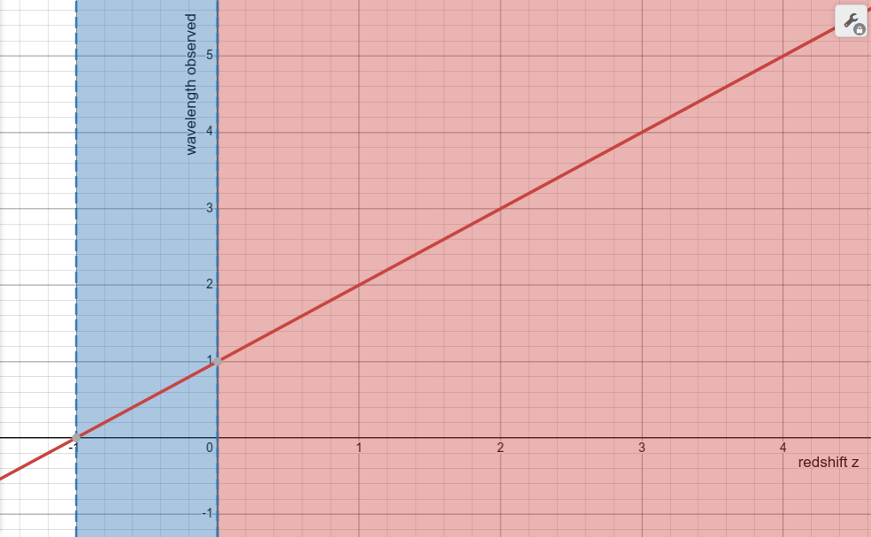
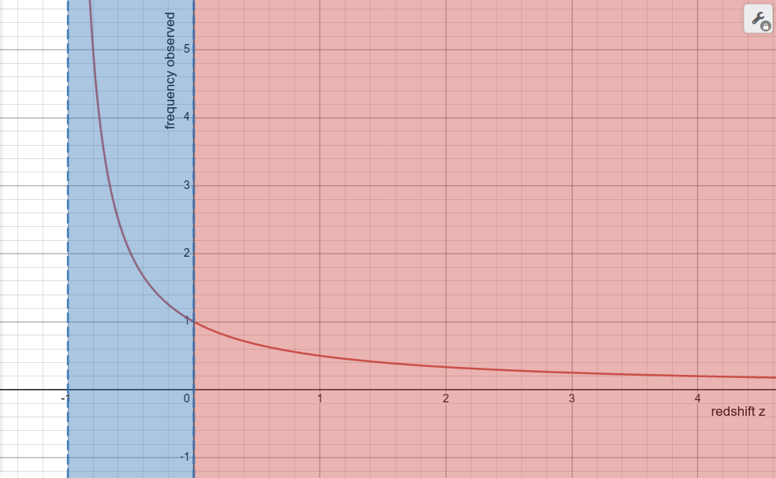
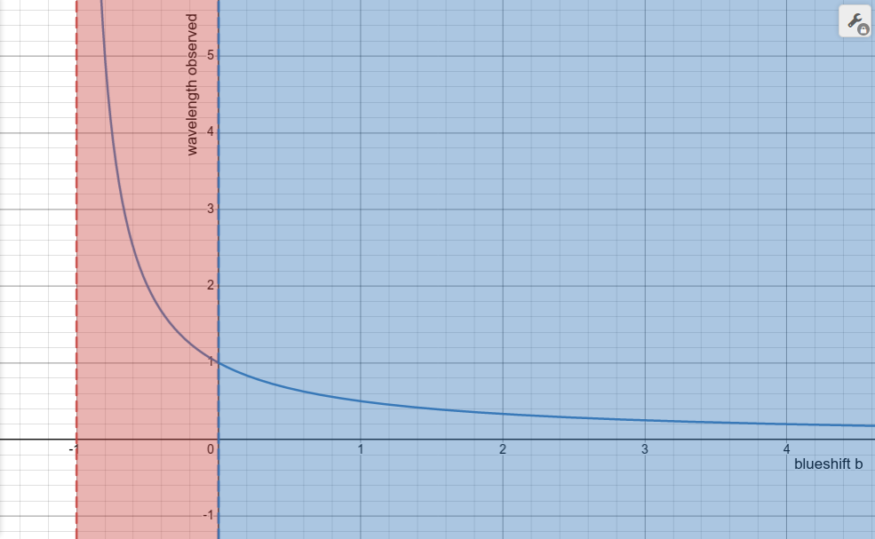
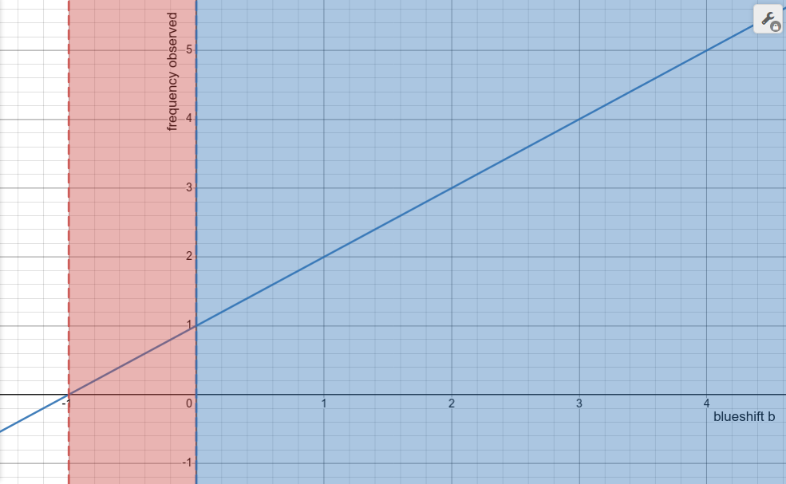
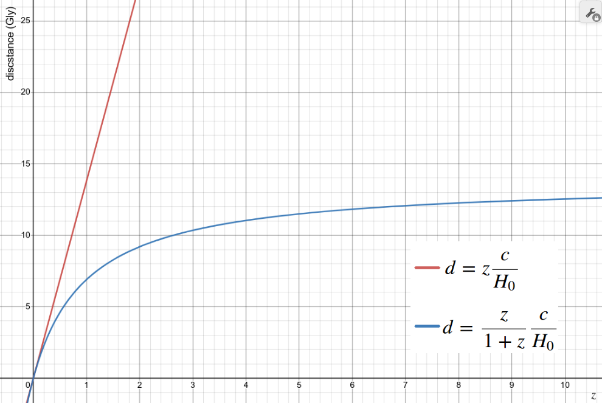
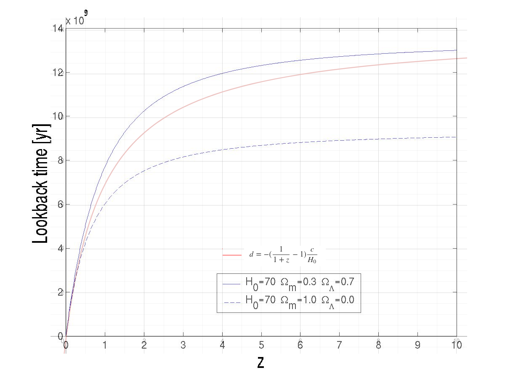
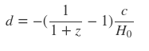

# An Alternative Quantification of Redshifts

## Background

Light is made of particles called photons, and photons have a wavelength, and that wavelength determines what color the photon is.

Red light has a higher wavelength than blue light. If a photon's wavelength were to increase for some reason, that is called redshift. And if the wavelength decreases, it is called blueshift. Whether the colors are red or blue before or after the shift, or whether they are in the visible range of light at all, doesn't matter. Just whether the wavelength increases (redshift) or decreases (blueshift).

As the universe expands, the wavelength of photons gets stretched, causing redshift.

## Redshift and wavelength

Based on the original wavelength (`w_emit`) of the photon, and wavelength it was observed to have after traveling through the expanding universe (`w_obs`), the amount of redshift (`z`) can be described as:

    1 + z = w_obs / w_emit

    w_obs = w_emit(z + 1)

This shows the effect of redshift `z` (shown on the x-axis) on the wavelength observed (shown on the y-axis) of a photon emitted with a wavelength of 1 nm.

The red and blue shading indicates where values of `z` are redshifted or blueshifted. When `z > 0`, that's redshift. Notice that when `z = -1`, the wavelength becomes zero. So the range of blueshift is finite and actually very small, `-1 < z < 0`.

## Redshift and frequency

A photon also has a frequency, which is related to wavelength by the speed of light (`c`):

    c = wavelength * frequency

There are also formulas for `z` using frequency:

    1 + z = f_emit / f_obs

    f_obs = f_emit / (1 + z)

This shows the effect of redshift `z` (shown on the x-axis) on the frequency observed (y-axis) of a photon emitted with a frequency of 1 THz.

The first thing you notice is that increasing redshift has the opposite effect on frequency as it does on wavelength. A higher `z` means a lower observed frequency.

The other thing to notice is that the frequency approaches zero as redshift approaches infinity, and that the frequency approaches infinity as redshift approaches `z = -1`. 

In the case of both wavelength and frequency, the blueshift region is small, `-1 < z < 0`, and the redshift region is infinite, `z > 0`.

## Redshift and energy

A photon also has energy, and that too is affected by redshifting. The energy of a photon and its frequency are directly related by Planck's constant (`h`):

    E = h f

That being the case, the formulas for redshift using energy are similar to those for redshift using frequency:

    1 + z = E_emit / E_obs

    E_obs = E_emit / (1 + z)

And the graph looks the same as it does for frequency. The more redshift, the less energy.

Redshift `z` goes in the direction of wavelength (more redshift, higher wavelength), but in the opposite direction of energy and frequency (more redshift, less energy and frequency).

## Blueshift

That redshift is going "with" wavelength, or "against" energy and frequency shouldn't make a difference. That can be investigated by inverting the redshift `z` formulas into blueshift `b` formulas:

    1 + b = w_emit / w_obs
    1 + b = f_obs / f_emit
    1 + b = E_obs / E_emit

Or:

    w_obs = w_emit / (b + 1)
    f_obs = f_emit(b + 1)
    E_obs = E_emit(b + 1) 

Now let's compare the blueshift `b` to the observed wavelength:

And observed frequency:

We see now the situation has reversed. Not only does energy and frequency rise when blueshift increases, but all the redshifting happens when `-1 < b < 0`.

All of `z > 0` now fits into `-1 < b < 0`.

Does that affect anything?

## Distance

The z-distance relation is:

    d = zc / H_0
    z << 1

This is only considered valid for very small values of `z`. At `z = 10`, the distance would be 140 billion light years. And since `z` can go up to infinity, the sky is the limit.

How about when redshifts are represented as negative blueshifts (`-b`) instead of `z`? Perhaps:

    d = -bc / H_0

Due to the `-b` in the equation, the distance will only be positive when `b < 0`. But `b` also cannot be less than or equal to -1. So `d < -(-1)c / H_0`, which means `c / H_0`, or Hubble's length, is the limit of distance by this relationship. 

To compare `z` and `-b`, assume a photon is emitted at 1 MeV. When the photon is observed at the following values, we can see a big difference.

|Observed (MeV):|Redshift z|Blueshift b|Distance(z)|Distance(-b)|
|---------------|----------|-----------|-----------|------------|        
|1              |0         |0          |0 Bly      |0 Bly       |
|0.5            |1         |-0.5       |14 Bly     |7.0 Bly     |
|0.33           |2         |-0.66      |28 Bly     |9.3 Bly     |
|0.25           |3         |-0.75      |42 Bly     |10.5 Bly    |    
|0.2            |4         |-0.8       |56 Bly     |11.2 Bly    |

We know from the redshift equations that `1 / (1 + z)` will give you the percentage of a frequency or energy that will be observed. To get the blueshift `b`, from that percentage you just subtract 1, so:

    b = 1 / (1 + z) - 1

Therefore, we could say:

    d = -(1 / (1 + z) - 1) c / H_0

Let's compare the original z-distance relationship with this new one.

The new z-distance relationship seems to be closely mimicking the lookback times from the current standard cosmological model, LCDM. LCDM has more parameters, and so leads to a wider variety of predictions. Let's compare two of those sets of parameters with the new z-distance relationship. Consider the distance `d` to be divided by `c` the speed of light, converting 1 billion light years (Gly) into 1 billion years (Gyr): 

## Conclusion

How redshift is quantified seems like an arbitrary choice. And it seems intuitive to think that `z = -1 * b`. But upon closer investigation, neither is true.

The convention of discussing light's wavelength rather than its frequency or energy is very understandable. Saying blue light is around 450 nanometers is more intuitive than speaking of its equivalent in terahertz or electron volts. And quantifying redshifts as a positive number that increases the wavelength follows logically from that. After all, it is the observation of redshifts, not blueshifts, that inspired modern cosmology.

But the conventional quantification of redshift as `z` leads to a distance relationship that is only valid at very low values of `z`. Alternatively, quantifying redshifts as `b` (where `-1 < b < 0`) leads to a distance relationship that closely matches observations and contemporary cosmological models.

